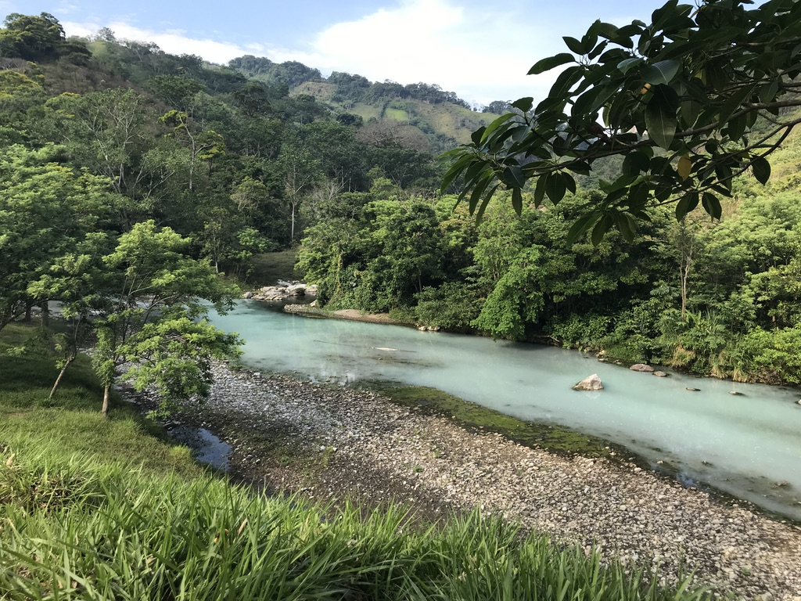

I am a Ph.D. candidate in WSU's School of Biological Sciences in [Dr. Joanna Kelley's lab](https://labs.wsu.edu/genomes/).
My work centers around adaptation to extreme environments.
I study poeciliid fishes that live in hydrogen sulfide-rich springs and cave environments.

A sulfidic spring in Southern Mexico.
