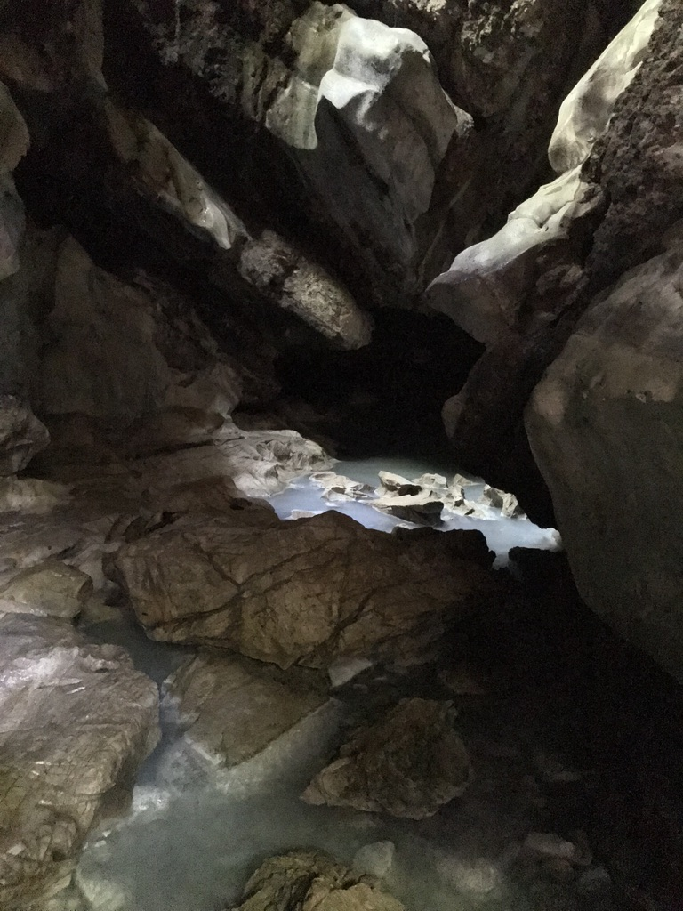

I am a Ph.D. candidate in Washington State University's School of Biological Sciences in [Dr. Joanna Kelley's lab](https://labs.wsu.edu/genomes/). My work centers around adaptation to extreme environments. I study poeciliid fishes that live in hydrogen sulfide-rich springs and cave environments.

A sulfidic spring in Southern Mexico.

Cueva del Azufre is a sulfidic cave near Tapijulapa, Mexico. Cavefish are exposed to low/no light and show a regressed eye phenotype compared to surface fish exposed to full light.
